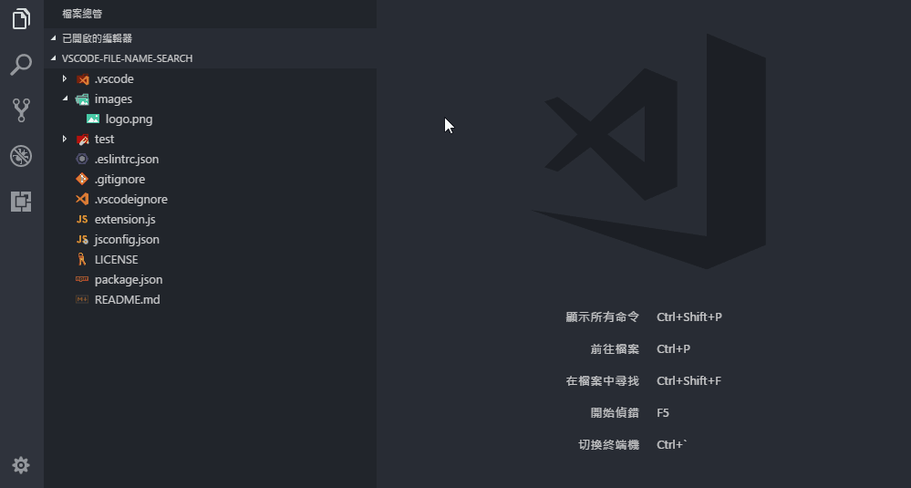

# File Name Search

Quickly search file name over all files.

## Usage

1. Right click on the file
2. Click `Search File Name`
3. Done

## License

The source code is licensed under the [MIT](License) license.